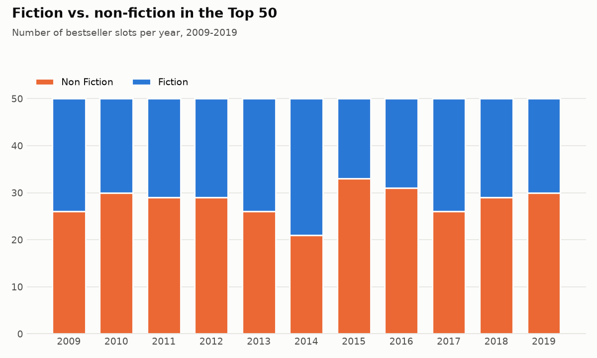
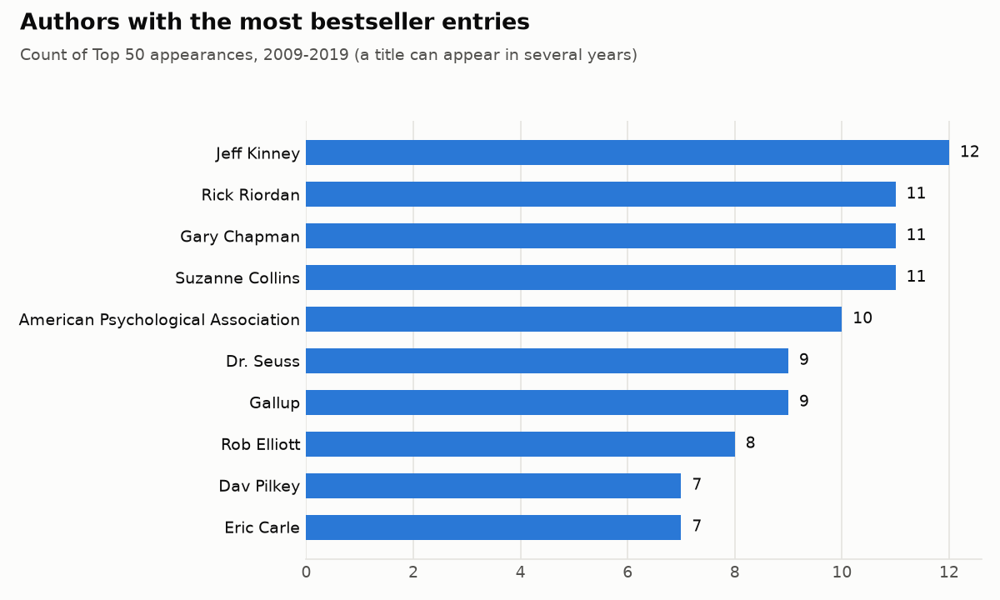
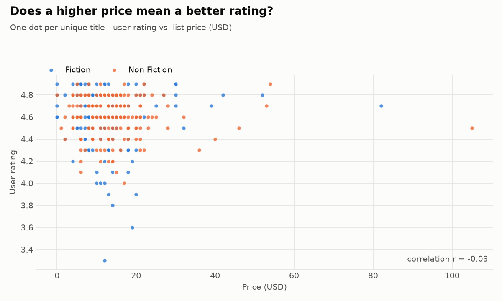

# 📚 Analyze Best Selling Amazon Books

A pandas analysis of **Amazon's Top 50 bestselling books, 2009–2019**: 550 entries covering 351 unique titles.

## Run
```bash
cd projects/amazon-bestsellers
pip install -r requirements.txt
python analysis.py
```

The script cleans the data (it drops duplicates, renames columns and fixes types) and prints a report with:
- the fiction vs. non-fiction split
- the top 10 authors by number of bestseller entries
- average rating, reviews and price for each genre
- the most-reviewed books and the books that stayed on the list longest
- the average price per year

Charts and CSV summaries are saved in `output/`.

## Findings
- **Non-fiction takes more slots** (56%) overall. Fiction peaked in 2014, when it had 29 of the 50 slots.
- **Jeff Kinney** (*Diary of a Wimpy Kid*) has the most entries (12). Rick Riordan, Gary Chapman and Suzanne Collins follow with 11 each.
- **Price doesn't predict rating.** The correlation between price and user rating is r = −0.03.
- Average list prices fell from about $15 in 2009 to about $10 in 2019.





## Data
`bestsellers.csv` is the public Kaggle dataset
[Amazon Top 50 Bestselling Books 2009–2019](https://www.kaggle.com/datasets/sootersaalu/amazon-top-50-bestselling-books-2009-2019),
which was scraped from Amazon and labeled as fiction or non-fiction using Goodreads.
